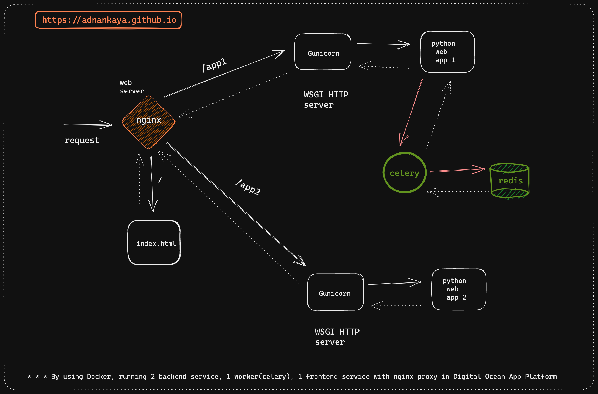

# Deploying a Multi-Component App with Backend API Services, a Celery Worker, and a Frontend Service on the Digital Ocean App Platform with an nginx proxy web server

- The project utilizes 2 backend API services, 1 worker (Celery) and 1 frontend service, all behind an nginx proxy web server, and is deployed on the Digital Ocean App Platform

## Want to have $200 on digital ocean ? Click the following DigitalOcean button to get your $200. 

- The following architecture shows the components:

 

